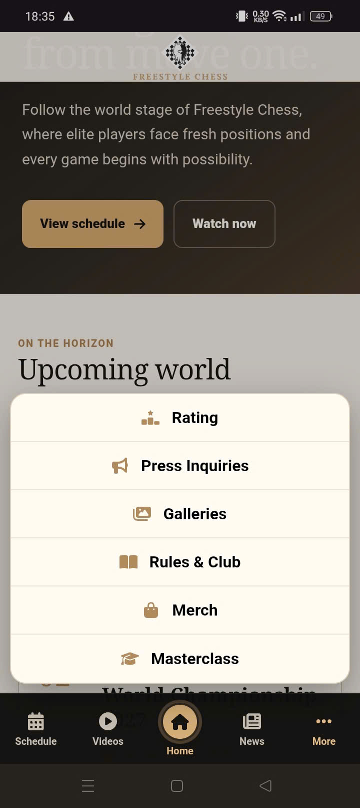
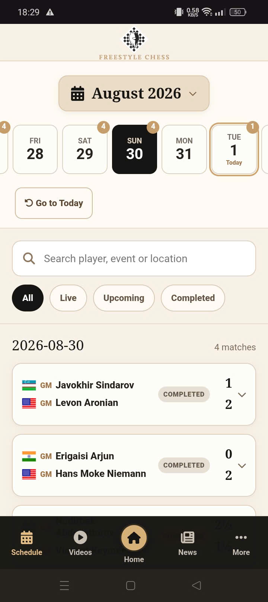
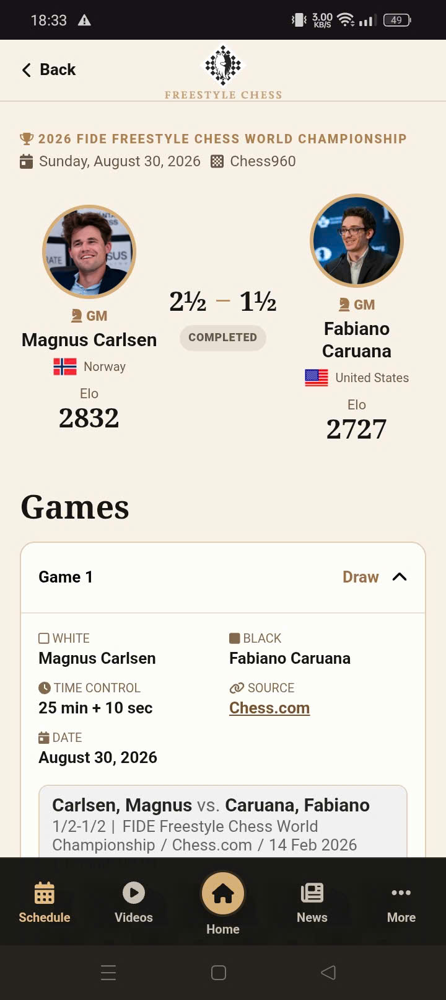

# PA4 - HI-FI PROTOTYPE

**Môn học:** Thiết Kế Giao Diện (CSC13112)  
**Giảng viên hướng dẫn:** TS. Lê Khánh Duy, ThS. Phạm Nguyễn Sơn Tùng  
**Nhóm thực hiện:** Nhóm 06 - **Lớp:** 23KTMP2    
**Thành viên nhóm:**  
- Lê Mai Hoài Bảo (23127326)
- Lâm Hữu Khánh (23127205)
- Phạm Chí Bảo Ninh (23127446)
- Trương Công Thiên Phú (23127455)
- Phùng Ngọc Tuấn (23127510)

---

**Link protoype: [testpa4.vercel.app](https://testpa4.vercel.app/)**

**Link video demo: [www.youtube.com/watch?v=pGMsQEdcXys](https://www.youtube.com/watch?v=pGMsQEdcXys)**

---

## 1. Giới Thiệu & Mục Tiêu Thiết Kế

Sau quá trình thử nghiệm định hình (Formative Usability Testing) với 6 biến thể nguyên mẫu giấy ở giai đoạn PA3, Nhóm 06 đã lựa chọn và hợp nhất hai giải pháp thiết kế:

1. **`Nav-1` (Fixed Bottom Navigation Bar):** Thanh điều hướng cố định 5 tab ở đáy màn hình, giải quyết triệt để vấn đề với ngón cái (Thumb Zone Reachability).
2. **`Sch-2` (Date Strip Filter + Dedicated 8×8 Match Detail):** Thanh trượt ngày trực quan kết hợp thẻ trận đấu cô đọng và màn hình phân tích thế trận bàn cờ 8×8.

Tại PA4, nhóm đã phát triển giải pháp này thành **High-Fidelity Prototype** hoàn chỉnh, có khả năng tương tác trực tiếp với dữ liệu thực tế trên mọi thiết bị di động.

---

## 2. Kiến Trúc Kỹ Thuật & Công Nghệ Hiện Thực

Prototype không sử dụng mockup tĩnh mà được hiện thực hóa bằng mã nguồn web tương tác thật:

* **Core Framework:** React 19 kết hợp TypeScript đảm bảo tính an toàn kiểu dữ liệu và cấu trúc component module hóa.
* **Build Tool & Runtime:** Vite cho tốc độ khởi động nhanh, hot-reloading tức thì và hiệu năng dựng hình mượt mà 60fps trên mobile.
* **Routing:** `React Router` với `HashRouter` hỗ trợ điều hướng không độ trễ và deploy static linh hoạt.
* **Design Tokens & Styling:** CSS thuần hiện đại (CSS Custom Properties), layout CSS Grid/Flexbox tối ưu cho chuẩn màn hình di động.
* **Thành phần tương tác cao cấp:** Radix Popover và React Day Picker cho bộ chọn ngày tháng (Date Picker Modal).
* **Dữ liệu gần thực tế:** Tích hợp thông tin giải đấu như *2026 FIDE Freestyle Chess World Championship*, hệ số ELO, ảnh chân dung của các Đại kiện tướng quốc tế (Magnus Carlsen, Lê Quang Liêm, Hikaru Nakamura, Fabiano Caruana, Vincent Keymer...) và bàn cờ trận đấu thật từ [chess.com](https://www.chess.com/).

---

## 3. Các thành phần chính trong prototype

### 3.1. Thanh Navigation

* **Fixed Bottom Navigation (Nav-1):** 5 tab cố định (*Schedule, Videos, Home, News, More*) ở cạnh dưới màn hình, nằm trong Thumb-reach zone với kích thước touch target đạt chuẩn $\ge 48\times 48\text{ px}$.
* **More Action Sheet:** Nhấn tab 'More' sẽ mở menu các trang phụ (Rating, Galleries, Merch,...) mà không che khuất thanh điều hướng chính. Có thể bấm vào bất kì vị trí nào trên nút tương ứng để mở trang phụ.

### 3.2. Màn hình Schedule

* **Top App Bar:** Tiêu đề trang, nút tìm kiếm và nút Date Picker.
* **Horizontal Date Strip:** Thanh trượt ngày cuộn ngang, cho phép chọn bất kỳ ngày nào trong tuần. Tab ngày đang chọn được highlight.
* **Date Picker Modal:** Cho phép nhảy nhanh đến các ngày xa trong tháng, đi kèm nút "Go to Today" để trở về ngày hiện tại.
* **Instant Search & Filter Chips:** Tìm kiếm tức thời theo tên kỳ thủ/địa điểm kết hợp bộ lọc trạng thái (*Live, Upcoming, Completed*).
* **Expandable Matchup Cards:** Thẻ trận đấu hiển thị cờ quốc gia, tên 2 kỳ thủ, ELO, trạng thái ván đấu và nút "View Details $\rightarrow$".

### 3.3. Màn hình Match Detail

* **Sticky Header & Contextual Back Button:** Nút Back rõ ràng ở góc trên bên trái, giúp quay lại đúng vị trí ngày và bộ lọc trên trang Schedule mà không bị mất trạng thái.
* **Player Banner:** Hiển thị thông tin 2 kỳ thủ, ELO, tỷ số, trạng thái trận.
* **Interactive 8×8 Chessboard:** Bàn cờ 8×8 trực quan hiển thị đúng thế trận thực tế của từng ván cờ.

---

## 4. Bốn Tiêu Chuẩn Công Thái Học & Khả Năng Tiếp Cận

1. **Touch Target Size $\ge 48\times 48\text{ px}$:** Loại bỏ hoàn toàn lỗi chạm trượt ngón cái.
2. **Thumb Zone Optimization:** Đưa các chức năng thường dùng nhất vào nửa dưới màn hình (Natural Thumb Zone).
3. **Contrast Ratio $\ge 4.5:1$:** Mục tiêu tương phản theo WCAG AA cho văn bản thông thường; nền Light Mode Clean giúp dễ đọc dưới ánh sáng ngoài trời.
4. **Phản hồi tức thì $< 250\text{ ms}$:** Toàn bộ vi tương tác (micro-interactions) phản hồi tức thì dưới 250ms tạo trải nghiệm mượt mà như Native App.
